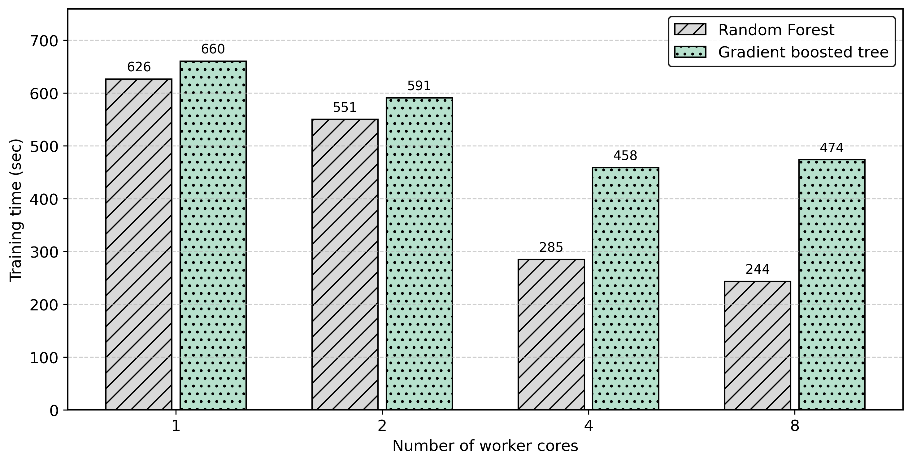

# Scalability and Accuracy Analysis of Machine Learning-Based IDS on Apache Spark

##  Project Overview
This project evaluates the scalability and performance of **Intrusion Detection Systems (IDS)** using **Apache Spark** and the **CSE-CIC-IDS2018 dataset**.  
The goal is to design and benchmark machine learning models that can handle **Big Data network traffic** efficiently, focusing on both **accuracy** and **computational cost**.

---

## Objectives
- Implement and compare two ensemble algorithms:
  - **Random Forest (RF)**
  - **Gradient Boosted Trees (GBT)**
- Preprocess and clean noisy/incomplete data.
- Perform **feature selection** using distributed Random Forest importance (reduce 80+ features → top 40).
- Address class imbalance using undersampling.
- Analyze **scalability** by varying Spark executor cores (1–8).
- Measure:
  - Training time
  - F1-score
  - AUC
  - Speedup & parallel efficiency

---

##  Dataset
The project uses the **CSE-CIC-IDS2018** dataset:

👉 [Download from Kaggle](https://www.kaggle.com/datasets/solarmainframe/ids-intrusion-csv)  

- Over **16 million network flows**
- **77+ features** describing traffic behavior
- Large-scale Big Data benchmark for IDS research

Due to its large size, the dataset is **not included** in this repository. Please download it from the link above.

---

## Implementation
The project is implemented with:
- **Apache Spark (PySpark)**
- **Spark MLlib** for machine learning
- **Python** for preprocessing and analysis

### Steps:
1. Load and preprocess dataset (clean missing values, normalize).
2. Apply feature selection.
3. Train RF and GBT classifiers.
4. Vary Spark executor cores (1–8).
5. Record metrics for accuracy and performance.

---

## 📊 Results (Summary)
- **Accuracy:** Both RF and GBT achieved **F1 > 0.999** and near-perfect **AUC**.
- **Scalability:**
  - RF reduced training time by **61%** (1 → 8 cores).
  - GBT showed modest gains (due to sequential nature).
  - Optimal trade-off at **4 cores** for both models.
- Spark proved highly effective in accelerating IDS tasks on Big Data.

## 📊 Detailed Performance Metrics

### Table 2: Random Forest Algorithm – Detailed Performance Metrics  

| Metric              | 1 Core   | 2 Cores  | 4 Cores  | 8 Cores  |
|---------------------|----------|----------|----------|----------|
| True Negatives (TN) | 431,879  | 431,879  | 431,993  | 433,308  |
| False Positives (FP)| 0        | 0        | 3        | 4        |
| False Negatives (FN)| 42       | 42       | 49       | 38       |
| True Positives (TP) | 196,887  | 196,887  | 197,359  | 196,831  |
| Precision           | 1.0000   | 1.0000   | 0.9999   | 0.9999   |
| Recall              | 0.9998   | 0.9998   | 0.9998   | 0.9998   |
| F1-Score            | 0.9999   | 0.9999   | 0.9999   | 0.9999   |
| AUC                 | 1.0000   | 1.0000   | 0.9999   | 0.9999   |
| Training Time (s)   | 626.3    | 550.6    | 284.7    | 243.6    |
| False Positive Rate (FPR) | 0.000000 | 0.000000 | 0.000007 | 0.000009 |
| False Negative Rate (FNR) | 0.000213 | 0.000213 | 0.000248 | 0.000193 |
| Optimal Threshold   | 0.82     | 0.82     | 0.80     | 0.70     |

---

### Table 3: Gradient Boosted Trees Algorithm – Detailed Performance Metrics  

| Metric              | 1 Core   | 2 Cores  | 4 Cores  | 8 Cores  |
|---------------------|----------|----------|----------|----------|
| True Negatives (TN) | 431,843  | 431,843  | 431,993  | 433,306  |
| False Positives (FP)| 36       | 36       | 3        | 6        |
| False Negatives (FN)| 40       | 40       | 41       | 41       |
| True Positives (TP) | 196,889  | 196,889  | 197,367  | 196,828  |
| Precision           | 0.9998   | 0.9998   | 0.9999   | 0.9999   |
| Recall              | 0.9998   | 0.9998   | 0.9998   | 0.9998   |
| F1-Score            | 0.9998   | 0.9998   | 0.9999   | 0.9999   |
| AUC                 | 1.0000   | 1.0000   | 0.9999   | 0.9999   |
| Training Time (s)   | 660.3    | 590.8    | 458.4    | 473.7    |
| False Positive Rate (FPR) | 0.000083 | 0.000083 | 0.000007 | 0.000014 |
| False Negative Rate (FNR) | 0.000203 | 0.000203 | 0.000208 | 0.000208 |
| Optimal Threshold   | 0.86     | 0.86     | 0.50     | 0.90     |

---

### Figure 3: Training Time of Random Forest vs. Gradient Boosted Trees  

